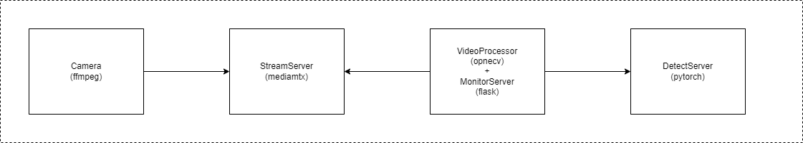
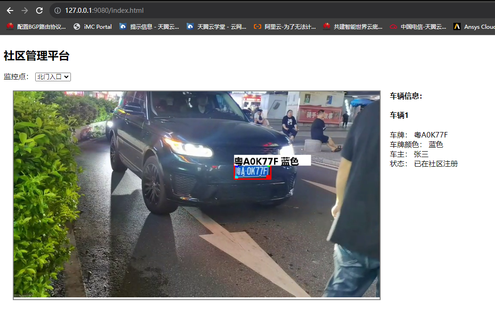

## 背景
- 一个研究工作需要视频AI应用作为测试业务，在网上发现这位大佬提供了车牌识别的开源项目we0091234/Chinese_license_plate_detection_recognition，感谢不尽!
- 本人基于大佬的项目，以社区监控为场景，搞了一个完整的测试业务.

## 架构

- VideoProcessor: 读取视频流，抽取图像，调用DetectServer的API进行车牌识别，并把结果放置到内存中
- MonitorServer: 提供社区监控Portal，每秒获取识别结果
- DetectServer: 提供车牌识别API

## 环境要求
- python 3.6.x
- 安装依赖库 pip install -r requirements.txt

## 模拟摄像头
- 准备一个linux机器, 安装好docker 
- 准备一个视频文件, 如放置到：/input/258_480p.mp4 
- 启动开源媒体服务器: 
docker run --rm -it --network=host bluenviron/mediamtx:latest 
- 利用ffmpeg读取一个视频文件，推流到媒体服务器: 
docker run --rm -it --network=host -v /input:/input jrottenberg/ffmpeg   -re -stream_loop -1 -i /input/258_480p.mp4 -vcodec copy -acodec copy -f flv  -flvflags no_duration_filesize   rtmp://127.0.0.1:1935/stream

## 启动DetectServer <待容器化>
python detect_server.py --detect_model weights/plate_detect.pt  --rec_model weights/plate_rec_color.pth --video rtmp://192.168.249.130:1935/stream --detect_svc_mode remote

## 启动VideoProcessor和MonitorServer <待容器化>
python video_processor.py --detect_model weights/plate_detect.pt  --rec_model weights/plate_rec_color.pth --video rtmp://192.168.249.130:1935/stream --detect_svc_mode remote

## 通过浏览器观察结果
http://127.0.0.1:9080/index.html

